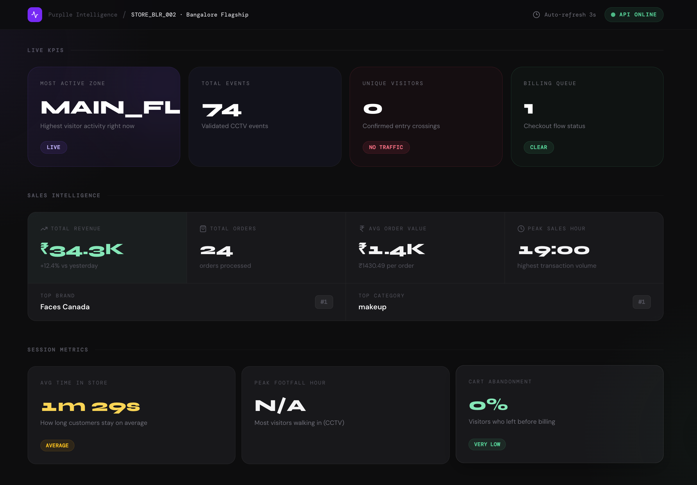
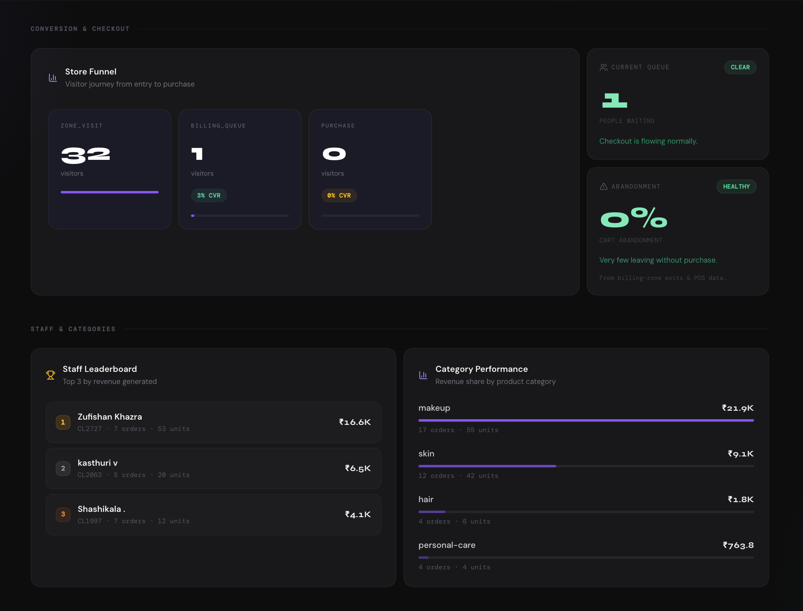
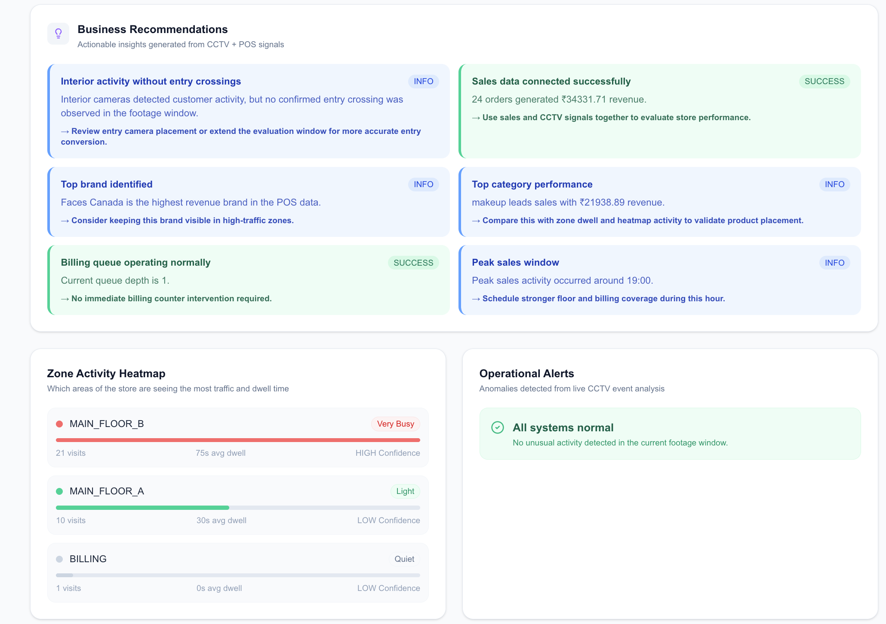

# Purplle Store Intelligence System
### AI-Powered Multi-Camera Retail Intelligence Platform


Built for **Purplle Tech Challenge 2026**

An end-to-end retail intelligence system that transforms **raw multi-camera CCTV footage + POS transactions** into actionable business insights such as visitor analytics, entry/exit intelligence, queue analytics, dwell time tracking, heatmaps, funnel conversion, staff performance, category performance, sales intelligence, and AI-powered business recommendations.

The system combines **Computer Vision**, **Event Pipelines**, and **Retail Analytics** to bridge the gap between **store activity** and **business outcomes**.

---

## Table of Contents

- [Problem Statement](#problem-statement)
- [System Overview](#system-overview)
- [Key Features](#key-features)
- [Dashboard Preview](#dashboard-preview)
- [Architecture](#architecture)
- [Dataset Understanding](#dataset-understanding)
- [Camera Semantics](#camera-semantics)
- [Retail Event Pipeline](#retail-event-pipeline)
- [Business Intelligence Layer](#business-intelligence-layer)
- [Project Structure](#project-structure)
- [Tech Stack](#tech-stack)
- [API Endpoints](#api-endpoints)
- [Running Locally](#running-locally)
- [Running with Docker](#running-with-docker)
- [Testing](#testing)
- [Design Decisions](#design-decisions)
- [Assumptions](#assumptions)
- [Known Limitations](#known-limitations)
- [Future Improvements](#future-improvements)
- [Demo Flow](#demo-flow)
- [Submission Checklist](#submission-checklist)

---

## Problem Statement

Retail stores generate large amounts of CCTV footage and sales data, but converting those raw signals into **business-relevant intelligence** is difficult.

This project solves that problem by building an **end-to-end retail intelligence system** that processes multi-camera CCTV footage, detects and tracks visitors, converts movement into structured retail events, computes store metrics, integrates POS transaction data, and produces actionable business recommendations.

> Instead of only detecting people, the system focuses on turning store activity into measurable business intelligence.

---

## System Overview

The platform operates across three layers.

**1. Computer Vision Layer** — processes synchronized CCTV feeds to generate structured visitor activity including person detection, multi-object tracking, visitor session tracking, entry/exit detection, queue monitoring, dwell analytics, and zone intelligence.

**2. Retail Intelligence Backend** — transforms raw events into funnel analytics, heatmaps, queue intelligence, visitor metrics, abandonment estimation, and anomaly detection.

**3. Business Intelligence Layer** — combines CCTV activity and POS transactions to generate revenue insights, staff performance, category performance, peak sales hours, brand intelligence, and business recommendations.

---

## Key Features

### Visitor Detection & Tracking

- YOLOv8n-based person detection
- Multi-object tracking
- Visitor session tracking
- Duplicate prevention
- Confidence-based filtering

### Multi-Camera Intelligence

Processes **5 synchronized cameras** simultaneously with camera-specific semantics, cross-camera retail understanding, and direction-aware event generation.

### Entry / Exit Intelligence

Uses virtual line crossing and movement direction instead of counting every detected person — preventing false positives caused by pedestrians outside the store, people standing near the entrance, or temporary occlusion.

Generated events: `ENTRY` / `EXIT`

### Dwell & Zone Analytics

Tracks customer movement, dwell duration, zone engagement, and busiest store sections.

Generated events: `ZONE_ENTER` / `ZONE_EXIT` / `ZONE_DWELL`

### Queue Intelligence

Billing area monitoring includes queue detection, queue depth estimation, abandonment estimation, and congestion alerts.

Generated events: `BILLING_QUEUE_JOIN`

### Staff Filtering

Applies lightweight heuristic-based staff filtering using movement patterns, camera context, and appearance cues. Staff events are excluded from customer funnels, queue analytics, and heatmaps.

### Sales Intelligence (POS Integration)

Integrates the provided POS transaction dataset to compute revenue intelligence (total revenue, order count, average order value, peak sales hours), staff performance, category performance, and brand intelligence.

### AI Business Recommendations

Generates explainable, deterministic business recommendations by combining CCTV signals and POS data — queue status, peak sales windows, top category performance, product placement opportunities, and entry mismatch warnings.

---

## Dashboard Preview

### Store Intelligence Dashboard


### Funnel view



### Recommendation Engine



---

## Architecture

```text
               ┌────────────────────┐
               │ CCTV Camera Feeds  │
               └─────────┬──────────┘
                         │
                         ▼
              ┌─────────────────────┐
              │ Computer Vision     │
              │ YOLOv8n + Tracking  │
              └─────────┬───────────┘
                        │
                        ▼
              ┌─────────────────────┐
              │ Event Generation    │
              │ Structured JSONL    │
              └─────────┬───────────┘
                        │
                        ▼
              ┌─────────────────────┐
              │ FastAPI Backend     │
              │ Metrics Engine      │
              └─────────┬───────────┘
                        │
        ┌───────────────┼────────────────┐
        ▼               ▼                ▼
  Funnel Engine      Heatmaps     Recommendations
                        │
                        ▼
              ┌─────────────────────┐
              │ Next.js Dashboard   │
              └─────────────────────┘
```

For full system design see [`docs/ARCHITECTURE.md`](docs/ARCHITECTURE.md).

---

## Dataset Understanding

**CCTV Data** — 5 synchronized store cameras.

**POS Dataset** — transactional sales data including invoice information, product details, salesperson data, quantity sold, GMV/NMV, revenue, product category, and order timestamps.

The system combines both datasets to create retail intelligence rather than isolated analytics.

---

## Camera Semantics

| Camera | Role            | Purpose                |
| ------ | --------------- | ---------------------- |
| CAM_1  | Main Floor A    | Zone analytics         |
| CAM_2  | Main Floor B    | Product engagement     |
| CAM_3  | Entry / Exit    | Visitor counting       |
| CAM_4  | Staff Area      | Excluded from analytics|
| CAM_5  | Billing Counter | Queue analytics        |

CAM_4 is excluded because observed footage indicated non-customer and staff/store room activity. Including it would contaminate customer analytics — precision was preferred over recall.

---

## Retail Event Pipeline

The system converts raw CCTV detections into structured retail events.

```text
Video Feed → YOLOv8n Detection → Multi-Object Tracking
    → Movement Interpretation → Retail Event Generation
    → Validation Layer → Database Ingestion
```

Generated event schema:

```json
{
  "event_id": "uuid-v4",
  "store_id": "STORE_BLR_002",
  "camera_id": "CAM_5",
  "visitor_id": "CAM_5_VIS_12",
  "event_type": "BILLING_QUEUE_JOIN",
  "timestamp": "2026-05-30T05:10:14Z",
  "zone_id": "BILLING",
  "dwell_ms": 0,
  "is_staff": false,
  "confidence": 0.91,
  "metadata": {
    "queue_depth": 3,
    "sku_zone": "BILLING_COUNTER",
    "session_seq": 2
  }
}
```

This event-first architecture ensures deterministic analytics, auditability, modularity, easier debugging, and reproducible outputs.

---

## Business Intelligence Layer

The system enriches CCTV analytics using POS data.

```text
High Footfall + High Dwell + Low Sales
    → Recommendation: Improve product placement

Queue Depth ↑ + Checkout Abandonment ↑
    → Recommendation: Open additional billing counter
```

This bridges store activity directly into business decisions.

---

## Project Structure

```text
.
├── api
│   ├── main.py
│   ├── bootstrap.py
│   ├── ingest_events.py
│   │
│   ├── core
│   │   └── database.py
│   │
│   ├── endpoints
│   │   ├── anomalies.py
│   │   ├── events.py
│   │   ├── funnel.py
│   │   ├── health.py
│   │   ├── heatmap.py
│   │   ├── metrics.py
│   │   ├── sales.py
│   │   └── recommendations.py
│   │
│   ├── repositories
│   │   └── event_repository.py
│   │
│   ├── tests
│   │   └── conftest.py
│   │   └── test_anomalies.py
│   │   └── test_api.py
│   │   └── test_funnel.py
│   │   └── test_heatmap.py
│   │   └── test_metrics.py
│   │   └── test_recommendations.py
│   │   └── test_sales.py
│   │
│   ├── services
│   │   ├── anomaly_service.py
│   │   ├── funnel_service.py
│   │   ├── heatmap_service.py
│   │   ├── metrics_service.py
│   │   ├── sales_service.py
│   │   └── recommendation_service.py
│   │
│   └── models
│       ├── db_models.py
│       └── schemas.py
│
├── client
│   ├── app
│   ├── components
│   ├── hooks
│   └── lib
│
├── pipeline
│   ├── detect.py
│   ├── tracker.py
│   ├── emit.py
│   ├── zones.py
│   └── validate_events.py
│
├── data
│   ├── Brigade_Bangalore.csv
│   ├── Brigade Road - Store_layout.xlsx
│   ├── camera_config.json
│   └── videos
│
├── assets
│
├── docs
│   ├── DESIGN.md
│   ├── CHOICES.md
│   ├── ARCHITECTURE.md
│   └── DEMO.md
│
├── docker-compose.yml
├── Dockerfile
└── README.md
```

---

## Tech Stack

**Computer Vision** — YOLOv8n (Ultralytics), OpenCV

**Backend** — FastAPI, SQLAlchemy, PostgreSQL, SQLite fallback

**Frontend** — Next.js, React, TailwindCSS, SWR, Lucide Icons

**Infrastructure** — Docker, Docker Compose

**Testing** — Pytest, service-level testing, API endpoint testing

---

## API Endpoints

Interactive API documentation: `http://127.0.0.1:8000/docs`

| Method | Endpoint | Description |
| ------ | -------- | ----------- |
| GET | `/health` | API status and last event timestamp |
| GET | `/stores/{store_id}/events` | All generated retail events |
| GET | `/stores/{store_id}/metrics` | Visitor count, queue depth, abandonment rate, busiest zone, dwell, peak hour |
| GET | `/stores/{store_id}/funnel` | Stage progression, conversion, drop-off |
| GET | `/stores/{store_id}/heatmap` | Zone intensity, dwell, engagement confidence |
| GET | `/stores/{store_id}/anomalies` | Congestion alerts, inactivity anomalies, suspicious behavior |
| GET | `/stores/{store_id}/sales/summary` | Revenue, orders, AOV, top brand, top category, peak hour |
| GET | `/stores/{store_id}/sales/staff-performance` | Salesperson contribution, revenue, units, orders |
| GET | `/stores/{store_id}/sales/category-performance` | Category revenue, orders, units sold |
| GET | `/stores/{store_id}/business/recommendations` | Explainable retail recommendations |

Example store ID: `STORE_BLR_002`

---

## Running Locally

**1. Clone Repository**

```bash
git clone https://github.com/mauliradhika/purplle-tech-challenge-round-2.git
cd purplle-tech-challenge-round-2
```

**2. Backend Setup**

```bash
python3 -m venv venv
source pipeline/venv/bin/activate
pip install -r api/requirements.txt
```

**3. Run Event Pipeline**

```bash
cd pipeline
python detect.py
python validate_events.py
```

**4. Start Backend**

```bash
uvicorn api.main:app --reload
```

Backend: `http://127.0.0.1:8000` — Swagger: `http://127.0.0.1:8000/docs`

**5. Start Frontend**

```bash
cd client
pnpm install
pnpm dev
```

Frontend: `http://localhost:3000`

---

## Running with Docker

```bash
# Start
docker compose up --build

# Stop
docker compose down
```

> Note: The frontend container may take ~20–40 seconds to fully start during the first cold build due to Next.js production compilation.

| Service   | URL                        |
| --------- | -------------------------- |
| Frontend  | http://localhost:3000      |
| Backend   | http://127.0.0.1:8000      |
| Swagger   | http://127.0.0.1:8000/docs |

---

## Testing

```bash
python -m pytest api/tests
```

Coverage includes sales analytics, recommendations, funnel logic, metrics, heatmaps, anomaly detection, and API endpoints.

---

## Design Decisions

Full design rationale: [`docs/DESIGN.md`](docs/DESIGN.md)

Engineering tradeoffs: [`docs/CHOICES.md`](docs/CHOICES.md)

Architecture deep-dive: [`docs/ARCHITECTURE.md`](docs/ARCHITECTURE.md)

Demo walkthrough: [`docs/DEMO.md`](docs/DEMO.md)

Key decisions covered: Why YOLOv8n? Why deterministic event generation? Why rule-based recommendations? Why camera-level semantics? Why event-driven architecture?

---

## Assumptions

- **Camera semantics** — camera roles were inferred from footage behavior; no explicit annotation file was provided
- **Queue region** — billing queue area was inferred visually
- **Store layout** — no polygon-level annotations were available; camera-level semantic zoning was used instead
- **POS mapping** — store IDs across CCTV and POS datasets differed; a deterministic alias mapping was introduced

---

## Known Limitations

- **No cross-camera ReID** — visitors are tracked per camera; true multi-camera identity persistence is not implemented
- **Heuristic staff filtering** — a dedicated trained classifier would improve accuracy
- **Camera-based zones** — heatmaps operate at camera/section level due to unavailable polygon zones
- **Rule-based recommendations** — LLM-powered generation could improve personalization

---

## Future Improvements

- Kafka event streaming and live event processing
- WebSocket live dashboard updates and real-time alerts
- Cross-camera identity persistence (ReID)
- Predictive analytics and ML-based forecasting
- Polygon-based zones and shelf-level analytics

---

## Demo Flow

1. Open dashboard at `http://localhost:3000`
2. Observe visitor analytics and funnel progression
3. Inspect heatmap intensity and queue intelligence
4. Review sales KPIs and staff performance
5. Review business recommendations
6. Open `http://127.0.0.1:8000/docs` and validate APIs
7. Review [**docs/DESIGN.md**](./docs//DESIGN.md) and [**docs/CHOICES.md**](./docs/CHOICES.md)

```text
CCTV → Events → Analytics → Business Intelligence
```

---

## Submission Checklist

- [x] Multi-camera CCTV processing
- [x] Event generation
- [x] Funnel analytics
- [x] Heatmaps
- [x] Queue intelligence
- [x] Staff filtering
- [x] POS integration
- [x] Sales analytics
- [x] Business recommendations
- [x] FastAPI APIs
- [x] Next.js dashboard
- [x] Testing
- [x] Dockerized deployment
- [x] Documentation

---

Built for **Purplle Tech Challenge 2026** — AI-Powered Retail Intelligence Platform